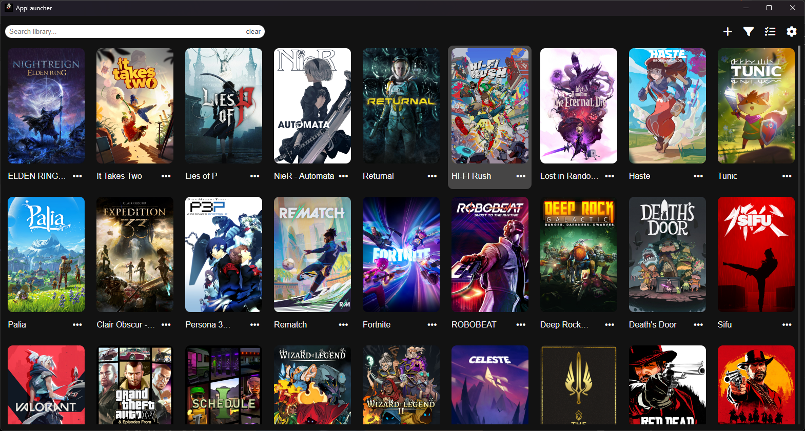

# Applauncher


A full featured launcher that can
1. Launching games from Steam, Epic, Ubisoft, Microsoft Store, or standalone `.exe` files.
1. Automatically fetches a game banner when a game is added via drag and drop.
1. Simple drag and drop to add a game.
1. The ability to add and launch web links in the default browser.
1. The ability to add folders and use them as shortcuts.
1. Shell-mode launching for apps needing separate terminals (like emulators).
1. Adding microsoft store/xbox games to the app and launching them from it.
1. Remotely launch apps from other devices on your local network.
1. Controller navigation.

# 🛠 Tech Stack
This app is built using the following technologies:

- Electron – for building the cross-platform desktop application.

- Vanilla JavaScript, HTML, and CSS – no frontend frameworks, just clean web technologies.

- Express – used for the optional local remote server feature (remote launching from other devices).

- get-windows-shortcut-properties – to read .lnk desktop shortcut properties.

- winreg – to access the Windows Registry and detect Microsoft Store/Xbox apps.

- Font Awesome – awesome free icons.

__The app doesn't fully support/untested on Linux and macOS if you want to try to use it on any of these platforms do at your own risk__

# Roadmap
| Feature | Progress |
| --------- | :----------: |
| App banner auto get | Done |
| Microsoft store launching | Done |
| Microsoft store adding | Done |
| Shortcut Location select | Done |
| Folder Adding and Editing | Done |
| Shell-mode for some apps | Done |
| Remote interface | Done |
| Playtime tracking | On-hold |
| Better controller support | Ongoing |
# Compiling the app:
1. download the source code
```bash
git clone https://github.com/Tommy1250/AppLauncherUI
```
2. cd into the project directory
```bash
cd AppLauncherUI
```
3. Install the packages
```bash
npm ci
```
4. Compile the app for your desired platform
- Windows
```bash
npm run build
```
- Linux
```bash
npm run build-linux
```
- MacOS
```bash
npm run build-macos
```
You can make a .deb installer using the electron-installer-debian package
```bash
npm run deb64
```
